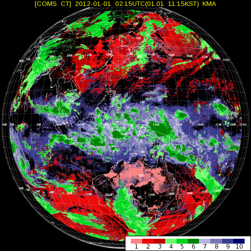
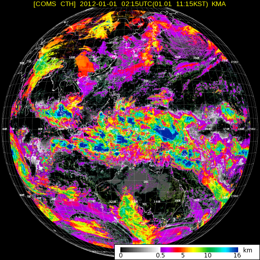
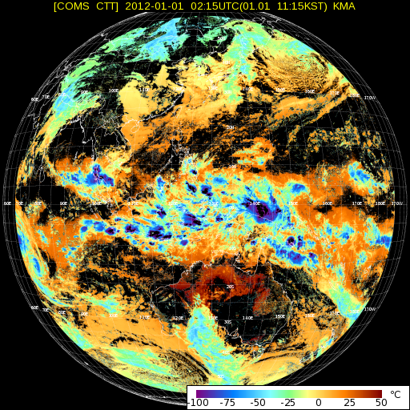

# COMS-1
Tools for COMS-1 LRIT satellite data

## lrit-header.py
Parses LRIT file and displays header information in a human-readable format.
```
usage: lrit-header.py [-h] [-f PATH]

Parses LRIT file and displays header information in a human-readable format.

optional arguments:
  -h, --help  show this help message and exit
  -f PATH     Input LRIT file
```

### Sample output
```
python3.6 lrit-header.py -f samples/lrit/IMG_ENH_01_IR1_20120101_000920_01.lrit
[Type 0 : Offset 0x0] Primary Header:
	Header length:         16
	File type:             0, Image data (IMG)
	Total header length:   4972 (0x136C)
	Data length:           3824184 (0x3A5A38)

[Type 1 : Offset 0x10] Image Structure Header:
	Header length:         9
	Bits per pixel:        8
	Image:                 Extended Northern Hemisphere (ENH)
	  - Columns: 1547
	  - Lines:   309
	Compression:           0, None

[Type 2 : Offset 0x19] Image Navigation Header:
	Header length:         51
	Projection:            Normalized Geostationary Projection (GEOS)
	Longitude:             128.2° E
	Column scaling factor: 8170135
	Line scaling factor:   4286797161
	Column offset:         773
	Line offset:           1010

[Type 3 : Offset 0x4C] Image Data Function Header:
	Header length:         4810 (0x12CA)
	Data Definition Block:
	  - dumped to "samples/lrit/IMG_ENH_01_IR1_20120101_000920_01_IDF-DDB.txt"

[Type 4 : Offset 0x1316] Annotation Header:
	Header length:         41 (0x29)
	Text data:             "IMG_ENH_01_IR1_20120101_000920_01.lrit"

[Type 5 : Offset 0x133F] Time Stamp Header:
	Header length:         10
	P Field:               01000000
	  - Extension flag:    0 (No extension)
	  - Time code ID:      100 (1958 January 1 epoch - Level 1 Time Code)
	  - Detail bits:       0000
	T Field:               010011010000101000000101000110001110111010000000
	  - Day counter:       19722 (01/01/2012 - DD/MM/YYYY)
	  - Milliseconds:      85520000 (23:45:20 - HH:MM:SS)

[Type 7 : Offset 0x1349] Key Header:
	Header length:         7
	Encryption key:        0x0 (disabled)

[Type 128 : Offset 0x1350] Image Segment Definition Header:
	Header length:         7
	Segment number:        1 of 4
	Line num of segment:   1
```

## Sample data
LRIT and HRIT sample data was obtained from [Korea Meteorological Administration's (KMA) National Meteorological Satellite Center (NMSC)](http://nmsc.kma.go.kr/html/homepage/en/chollian/Introduction/selectIntroduction.do). Code examples and xRIT Mission Specific Implementation documents are also provided.

## Sample VIS Image

Image obtained from [KMA NMSC](http://nmsc.kma.go.kr/html/homepage/en/satellite/searchSatelliteImageN.do?data_type=1001)

## Sample Additional (ADD) data
### Alpha-numeric Text (ANT)
```
COMS MI LRIT WOP(Weekly Operation Plan) 

BY NATIONAL METEOROLOGICAL SATELLITE CENTER, KOREA METEROLOGICAL ADMINSTRATION

DISSEMINATION SCHEDULE FROM 2012/01/02 TO 2012/01/08
UPDATE 2012/01/01

NOTE: 

＊ FOR SEMI REAL-TIME INFORMATIN ON COMS OPERATION, PLEASE REFER TO FOLLOWING WEBSITE. (http://nmsc.kma.go.kr)

＊An wheel off-loading maneuver is scheduled from [00:45:00.000] on [2012/01/02~01/08]. 
   For about 20 minutes, the image quality might be temporarily deteriorated. 
   For about 20 minutes, the image might be disseminated with chipping. (See the following schedule for the details)
＊An wheel off-loading maneuver is scheduled from [06:45:00.000] on [2012/01/02~01/08]. 
   For about 20 minutes, the image quality might be temporarily deteriorated. 
   For about 20 minutes, the image might be disseminated with chipping. (See the following schedule for the details)

SCHEDULE:

TIME(UTC)        LRIT    ABBR_ID 02 03 04 05 06 07 08
0009-0012        E01        ENH  O  O  O  O  O  O  O
0024-0027        E02        ENH  O  O  O  O  O  O  O
0028-0030        C01         CT  O  O  O  O  O  O  O
0032-0034        C01        CTH  O  O  O  O  O  O  O
...
```
Alpha-numeric Text sample continued in [samples/lrit/ADD_ANT_01_20120101_113500_00_DATA.txt](samples/lrit/ADD_ANT_01_20120101_113500_00_DATA.txt)

### Cloud images
Cloud Type (CT) | Cloud Top Height (CTH) | Cloud Top Temperature (CTT)
------------ | ------------- | -------------
 |  | 
